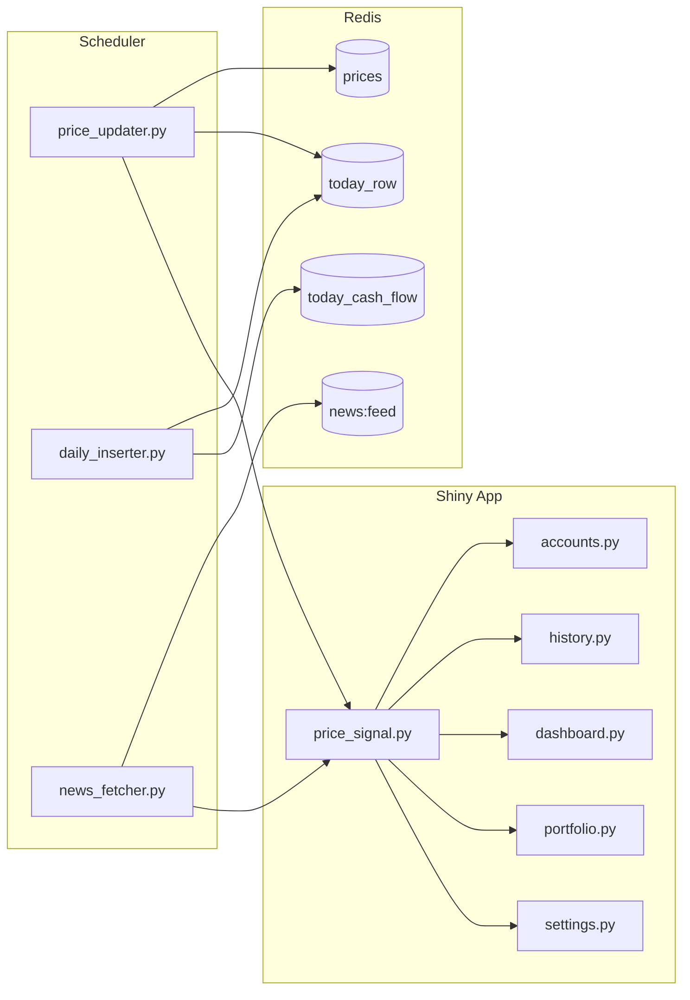

# 이벤트 흐름 맵

---

## 1. 전체 흐름

---

## 2. Redis pub/sub 채널

| 채널 | 발행자 | 구독/반응 주체 | 의미 |
|------|--------|----------------|------|
| `price_updated` | `price_updater_rest.py`, `price_updater_ws.py`, `price_updater_common.py` | `price_signal.py` | 현재가 갱신 |
| `position_changed` | `accounts.py` | `price_signal.py` | 포지션/현금 수정 |
| `ticker_changed` | `accounts.py`, `settings.py` | `price_signal.py` | 티커 메타 수정 |
| `daily_inserted` | `daily_inserter.py` | `price_signal.py` | 일간 스냅샷 갱신 |
| `news_keyword_changed` | `settings.py` | `news_fetcher.py` | 뉴스 키워드 변경 |
| `news_source_changed` | `settings.py` | `news_fetcher.py` | 뉴스 소스 변경 |
| `news_feed_updated` | `news_fetcher.py` | `price_signal.py` | 뉴스 피드 갱신 |

---

## 3. price_signal.py 역할

`price_signal.py` 는 Redis pub/sub 메시지를 받아 앱 내부 반응형 신호로 변환한다.

### 신호

| 신호 | 의미 |
|------|------|
| `price_signal` | 현재가가 바뀜 |
| `position_signal` | 포지션/현금이 바뀜 |
| `ticker_signal` | ticker 메타가 바뀜 |
| `daily_insert_signal` | daily_summary 가 바뀜 |
| `news_feed_signal` | 뉴스 피드가 바뀜 |

### 동작

- `redis.pubsub()` 로 채널을 구독한다.
- 메시지가 오면 대응되는 signal 값을 증가시키거나 재설정한다.
- 앱의 각 탭은 이 signal 을 reactive dependency 로 사용한다.

---

## 4. 화면 반응 흐름

### price_updated

1. `price_updater.py` 가 Redis `prices` 를 갱신한다.
2. `publish_price_updated()` 가 호출된다.
3. `price_signal.py` 가 메시지를 받아 `price_signal` 을 올린다.
4. `dashboard.py`, `portfolio.py`, `accounts.py`, `settings.py` 가 해당 신호를 보고 현재가를 다시 읽는다.

### position_changed

1. `accounts.py` CRUD 완료
2. `refresh_position_cache()` 및 `recalc_today_row()` 수행
3. `publish_position_changed()` 호출
4. 다른 탭이 포지션/총자산을 다시 계산한다.

### daily_inserted

1. `daily_inserter.py` 가 `daily_summary` 를 upsert 한다.
2. `publish_daily_inserted()` 호출
3. `history.py` 가 오늘 행/과거 행 렌더링을 갱신한다.

### news_feed_updated

1. `news_fetcher.py` 가 뉴스 피드를 갱신한다.
2. Redis `news:feed` 와 번역 캐시를 갱신한다.
3. `publish_news_feed_updated()` 호출
4. `settings.py` 의 뉴스 패널이 다시 렌더링된다.

---

## 5. 현재 주의사항

- 시그널 이름과 pub/sub 채널 이름은 1:1로 문서화해야 한다.
- UI 는 DB 폴링보다 Redis 신호를 우선해서 다시 그린다.
- 뉴스 피드 흐름은 `settings.py` 와 `news_fetcher.py` 의 결합을 기준으로 읽어야 한다.